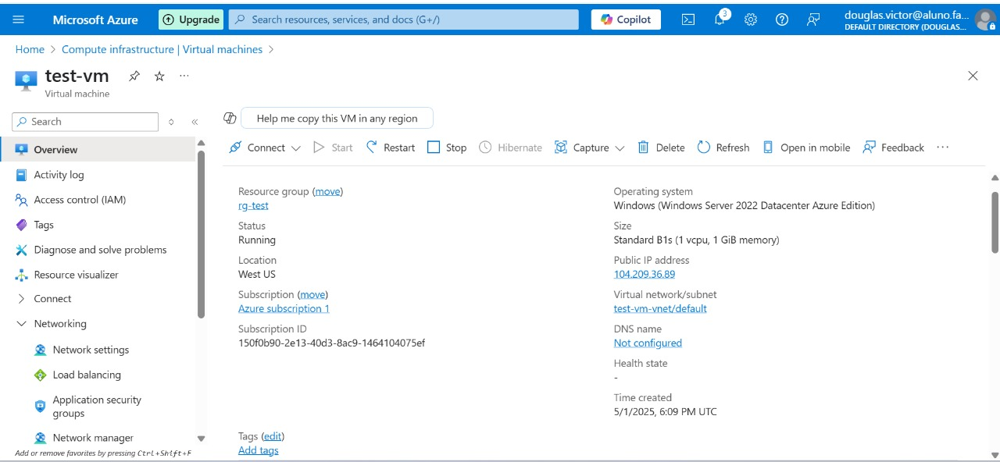
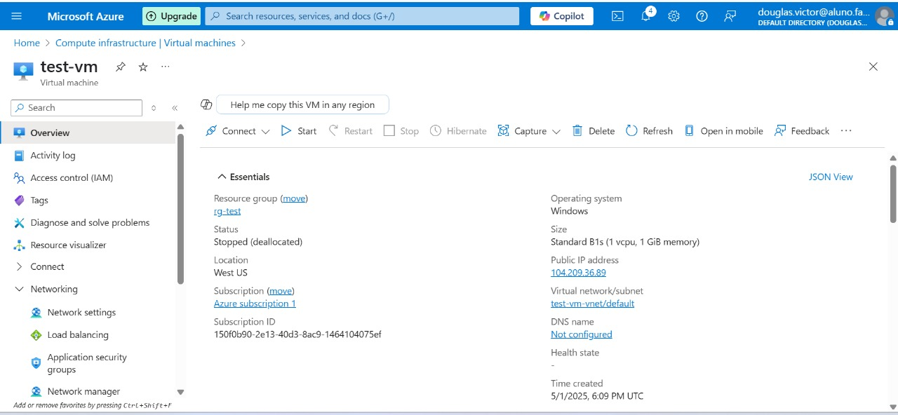

# ☁️ Desafio Azure - Documentação Técnica

Este repositório foi criado como parte do desafio do bootcamp de Cloud e Inteligência Artificial, com o objetivo de reunir **resumos, anotações e dicas práticas** sobre a criação e o uso de máquinas virtuais no Microsoft Azure. O conteúdo aqui serve como apoio para revisões futuras e aplicações práticas.

---

## 💡 Como a computação em nuvem funciona

- **O que é computação em nuvem?**  
  É o fornecimento de recursos computacionais (como armazenamento, servidores, bancos de dados, rede e software) por meio da internet, a partir de centros de dados gerenciados por grandes provedores, como Microsoft Azure, AWS, Google Cloud, entre outros.

- **Como funciona?**  
  Em vez de investir em infraestrutura local, as empresas contratam serviços de nuvem para utilizar apenas os recursos de que precisam, no momento em que precisam. Isso permite escalabilidade, redução de custos operacionais e maior flexibilidade. Os recursos são hospedados em data centers mantidos pelos provedores e acessados remotamente.

- **Por que e onde utilizamos?**  
  A computação em nuvem pode ser adotada em diferentes modelos, dependendo da estratégia da empresa:

  - **On-premises:** infraestrutura mantida localmente pela empresa  
  - **Nuvem pública:** recursos fornecidos por terceiros (Azure, AWS, GCP, IBM Cloud etc.)  
  - **Nuvem híbrida:** combinação entre estrutura local e serviços de nuvem pública

---

## 📘 AZ-900: Conceitos básicos do Microsoft Azure

- Fundamentos e conceitos do Azure  
- Principais serviços da plataforma  
- Soluções e ferramentas de gerenciamento e segurança (geral e de rede)  
- Governança, privacidade, conformidade e controle de custos

---

## 🔍 Conceitos fundamentais da computação em nuvem

- **Computação em nuvem:** uso de tecnologias de virtualização em data centers remotos oferecidos por grandes provedores
- **Responsabilidade compartilhada:** o provedor é responsável pela segurança da nuvem, o cliente pela segurança dos seus dados e configurações
- **Modelos de implantação:** pública, privada e híbrida
- **Modelo baseado em consumo:** paga-se apenas pelo que for utilizado
- **Custo operacional vs. custo de capital:** o modelo em nuvem evita grandes investimentos iniciais em infraestrutura

---

## ✅ Como criar uma conta gratuita no Azure

1. Acesse [https://azure.microsoft.com](https://azure.microsoft.com)  
2. Clique em **“Experimente o Azure gratuitamente”**  
3. Preencha os dados solicitados  
4. Use um cartão temporário (ou virtual) para evitar cobranças indevidas  

---

## 🌟 Benefícios da nuvem

- **Alta disponibilidade:** serviços acessíveis com garantias de SLA
- **Escalabilidade:** aumenta ou reduz os recursos conforme a demanda
- **Elasticidade:** adapta os recursos automaticamente com base no uso
- **Confiabilidade:** falhas em uma região não comprometem o serviço global
- **Previsibilidade:** controle de custos e desempenho
- **Segurança:** ferramentas avançadas, com responsabilidade compartilhada
- **Governança:** políticas e auditorias para manter conformidade
- **Gerenciabilidade:** gerenciamento via portal, CLI, API ou PowerShell

---

## 📸 Imagens

As imagens abaixo representam o processo de criação da máquina virtual no Azure:

- 
- 
- 
- 

---

## 📎 Observação

Regiões como **Brazil South** possuem limitações quanto à escolha automática de zonas de disponibilidade. Para evitar erros durante a criação da VM, recomenda-se usar regiões como `East US` ou selecionar “Nenhuma redundância de infraestrutura” ao configurar a máquina virtual.

---

## ✍️ Autor

Douglas Victor da Silva  
Aluno de Sistemas de Informação | Faculdade Impacta  
Bootcamp: Cloud Computing & IA – DIO